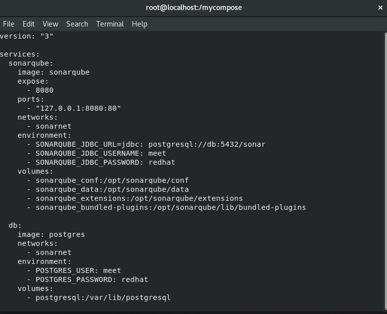

# Docker-Project
Docker-compose project for Running Wordpress along with MySQL and Running SonarQube using Docker-compose

# Wordpress-MySql Docker-compose
WordPress (WordPress.org) is a free and open-source content management system (CMS) written in PHP and paired with a MySQL or MariaDB database WordPress was originally created as a blog-publishing system but has evolved to support other types of web content including more traditional mailing lists and forums, media galleries, membership sites, learning management systems (LMS) and online stores.WordPress is one of the most popular content management system solutions in use. WordPress has also been used for other application domains such as pervasive display systems (PDS).

# SonarQube-MySQL Docker-Compose
SonarQube (formerly Sonar) is an open-source platform developed by SonarSource for continuous inspection of code quality to perform automatic reviews with static analysis of code to detect bugs, code smells, and security vulnerabilities on 20+ programming languages. SonarQube offers reports on duplicated code, coding standards, unit tests, code coverage, code complexity, comments, bugs, and security vulnerabilities. SonarQube includes support for the programming languages Java (including Android), C#, PHP, JavaScript, TypeScript, C/C++, Ruby, Kotlin, Go, COBOL, PL/SQL, PL/I, ABAP, VB.NET, VB6, Python, RPG, Flex, Objective-C, Swift, CSS, HTML, and XML.

## Technologies Used:
1. RHEL8
2. Docker
3. Wordpress
4. MySQL
5. SonarQube

### Requirements:
To run the above mentioned two docker-compose project , below mentioned Softwares must be installed:
1. Redhat Linux 8,RHEL8
2. Docker
3. Docker-compose

## To Start Docker service
 ```
 $ systemctl start docker
 ```
## To Install Docker-compose
   Run the following commands:
   ```
   # curl -L https://github.com/docker/compose/releases/download/1.25.5/docker-compose-`uname -s`-`uname -m` -o /usr/local/bin/docker-compose
# chmod +x /usr/local/bin/docker-compose
```
### To download the Images for the Project
  Run the following commands:
  ```
docker pull sonarqube
docker pull wordpress:5.1.1-php7.3-apache
docker pull mysql
```
## To Setup Docker-compose
Run the following commands:
```
mkdir /mycompose
```
Above command creates a path for our docker-compose files to be stored in.
Now, To create Docker-compose files Run the following commands:
```
vim docker-compose.yml
```
We can now edit the docker-compose.yml.

## Creating Docker-compose.yml for Wordpress-MySQL Project:
Put the following code in docker-compose.yml,
```
version: '3.2'

services:
  dbos:
    image: mysql
    volumes:
      - mysql_storage_new:/var/lib/mysql
    restart: always         
    environment:
      MYSQL_ROOT_PASSWORD: rootpass
      MYSQL_USER: meet
      MYSQL_PASSWORD: redhat
      MYSQL_DATABASE: mydb
  wordpressos:               
    image: wordpress:5.1.1-php7.3-apache
    restart: always
    depends_on:
      - dbos
    ports: 
      - 8080:81
    environment:
      WORDPRESS_DB_HOST: dbos
      WORDPRESS_DB_USER: meet
      WORDPRESS_DB_PASSWORD: redhat
      WORDPRESS_DB_NAME: mydb
    volumes:
      - wp_storage_new:/var/www/html 
volumes:
  mysql_storage_new:
  wp_storage_new: 

```


## Creating Docker-compose.yml for SonarQube-PostgreSQL Project:

```
version: "3.2"

services:
  sonarqube:
    image: sonarqube
    expose:
      - 9000
    ports:
      - "127.0.0.1:9000:80"
    networks:
      - sonarnet
    environment:
      - SONARQUBE_JDBC_URL=jdbc:postgresql://db:5432/sonar
      - SONARQUBE_JDBC_USERNAME=admin
      - SONARQUBE_JDBC_PASSWORD=redhat
    volumes:
      - sonarqube_conf:/opt/sonarqube/conf
      - sonarqube_data:/opt/sonarqube/data
      - sonarqube_extensions:/opt/sonarqube/extensions
      - sonarqube_bundled-plugins:/opt/sonarqube/lib/bundled-plugins

  db:
    image: postgres
    networks:
      - sonarnet
    environment:
      - POSTGRES_USER=meet
      - POSTGRES_PASSWORD=redhat
    volumes:
      - postgresql:/var/lib/postgresql
      - postgresql_data:/var/lib/postgresql/data

networks:
  sonarnet:

volumes:
  sonarqube_conf:
  sonarqube_data:
  sonarqube_extensions:
  sonarqube_bundled-plugins:
  postgresql:
  postgresql_data:
  ```
  
   
## Running Docker-compose
  Now to run any of the docker-compose files just run the following commands inside mycompose directory
  ```
  docker-compose up
  ```
  
  
  
  
